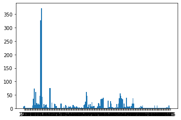
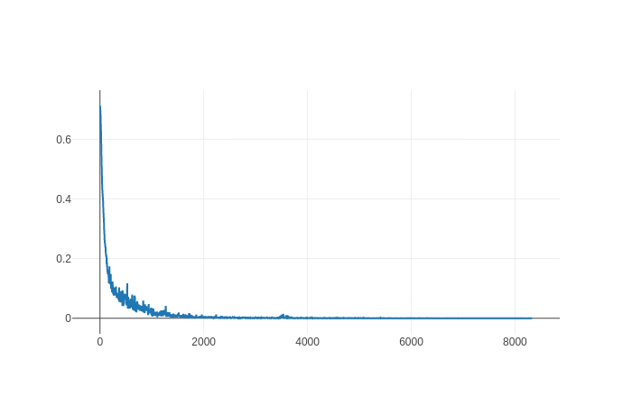
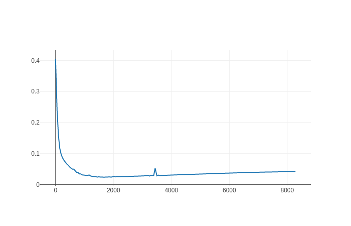

# Executive Summary
There are numerous ways to assign categories to a product. They can be 
 divided into manually engineered features (MEF, rule based, regex) and 
 deep learning techniques (DLT). 
 
I chose to go for DLT over the MEF, as
   1. a DLT-solution bears less manual effort, vs. with MEF it would take long to create rules for 68 categories
   2. a DLT-solution is easier to adapt and modify
   3. a DLT-solution is cheaper in the long-term
    
I used a transformer language model [transformer language model](https://arxiv.org/pdf/1706.03762.pdf), 
namely BERT. With the library called [FARM](https://github.com/deepset-ai/FARM)
    it is fairly easy to fine-tune a German model for text classification. Also 
     all pre- and post-processing steps are done by the library 
    (tokenization etc), which avoids duplicate code.

To mimik Google Cloud Platform, I created a docker
 image container. The pseudo_pipeline is a tiny version of a pipeline Media Markt could have.
In this pipeline it is possible to send requests to get the product's categories.

The model reached 46% f1 macro on the dev data-set and 29% on the 
test set. This value is very reasonable, given the size of the data-set 
and the number of categories. The model used in the service can easily 
be changed for a different model architecture with different pre- and 
post-processing steps.
 

# Repository structure
* **Category Service:** containing the category's prediction service.
* **Data:** containing all data created and needed.
* **Data Analysis:** Jupiter Notebook, containing simple data 
analysis I performed.
* **Model:** containing a data structure (Product) and some helper
 functions.
* **Pseudo pipeline:** containing the controller and the category
 client necessary to run a local data pipeline.
* **Research and development:** containing most of the experiments 
that have been performed in order to find out the best solution to use.

#DLM Solution
## Data Analysis
I performed a small data analysis within the Jupiter Notebook. Please have a look at the
Notebook for more insights:
`data_analysis/data_analytic.ipynb`

By performing simple data analytics, I was able to see that
not all columns always had content. That's why a combination of several columns is necessary in order to 
predict the categories and train the model.

The graph below shows the label occurrences. They aren't balanced. Most of them appear less than 50
times.

The data is highly unbalanced. This should be solved.
 Also the training dataset is incomplete (some labels present in the 
labelled product are not in my hash table id-label) and the set is very small.

So 3 of the 4V aren't respected:
- volume
- variety
- veracity

## Train the model
To train the model please run
 `research_and_development/train_model/train_multi_label_multi_class.py`
## Architecture
It is BERT language model (for german). The last layer is the classification layer for multi-class 
multi-label classification.

## Results analysis

Below you can see the performances on the dev and test sets.
Because the training data sets are small, the results are showing the real
quality of the trained model.

By looking at the train and dev loss, one can see the model perfectly learned, without
doing over or under fitting.

\\|//       \\|//      \\|//       \\|//     \\|//
^^^^^^^^^^^^^^^^^^^^^^^^^^^^^^^^^^^^^^^^^^^^^^^^^^^^^^
***************************************************
***** EVALUATION | DEV SET | AFTER 19608 BATCHES *****
***************************************************
\\|//       \\|//      \\|//       \\|//     \\|//
^^^^^^^^^^^^^^^^^^^^^^^^^^^^^^^^^^^^^^^^^^^^^^^^^^^^^^

12/20/2020 20:48:04 - INFO - farm.eval -   
 _________ text_classification _________
12/20/2020 20:48:05 - INFO - farm.eval -   loss: 0.04217879896522233
12/20/2020 20:48:05 - INFO - farm.eval -   task_name: text_classification
12/20/2020 20:48:05 - INFO - farm.eval -   f1_macro: 0.3836290515470082
12/20/2020 20:48:05 - INFO - farm.eval -   report: 
               precision    recall  f1-score   support

         310     0.7143    0.7143    0.7143         7
         259     0.0000    0.0000    0.0000         0
         261     0.0000    0.0000    0.0000         2
         300     0.0000    0.0000    0.0000         0
         279     0.0000    0.0000    0.0000         0
         224     0.6667    1.0000    0.8000         2
         299     0.0000    0.0000    0.0000         0
         249     0.0000    0.0000    0.0000         0
         332     1.0000    1.0000    1.0000         4
         247     0.0000    0.0000    0.0000         0
         293     1.0000    0.4000    0.5714         5
         297     0.0000    0.0000    0.0000         0
         207     0.0000    0.0000    0.0000         0
         326     0.0000    0.0000    0.0000         1
         308     0.0000    0.0000    0.0000         1
         298     1.0000    1.0000    1.0000         3
        8022     1.0000    0.5000    0.6667         2
         324     0.0000    0.0000    0.0000         0
         342     0.0000    0.0000    0.0000         0
         301     0.0000    0.0000    0.0000         0
         294     0.0000    0.0000    0.0000         2
         312     0.0000    0.0000    0.0000         1
         210     0.0000    0.0000    0.0000         0
         257     1.0000    0.3333    0.5000         6
         788     1.0000    0.6000    0.7500        10
         750     0.0000    0.0000    0.0000         0
         252     0.9091    0.9091    0.9091        11
         253     1.0000    0.5000    0.6667         2
         749     1.0000    0.8000    0.8889         5
        8021     0.0000    0.0000    0.0000         0
         315     0.7895    0.7500    0.7692        20
         262     0.0000    0.0000    0.0000         1
         311     0.0000    0.0000    0.0000         0
         319     0.0000    0.0000    0.0000         0
         208     0.0000    0.0000    0.0000         1
         233     1.0000    1.0000    1.0000         4
         238     0.0000    0.0000    0.0000         0
         231     0.0000    0.0000    0.0000         1
         237     1.0000    1.0000    1.0000         7
         322     0.0000    0.0000    0.0000         0
         286     0.0000    0.0000    0.0000         0
         296     1.0000    1.0000    1.0000         2
         325     0.0000    0.0000    0.0000         0
         303     1.0000    0.5000    0.6667         2
         225     0.0000    0.0000    0.0000         1
         223     0.0000    0.0000    0.0000         0
         784     1.0000    1.0000    1.0000         4
         305     1.0000    0.5000    0.6667         2
         255     1.0000    0.6667    0.8000         3
         295     1.0000    1.0000    1.0000         5
         314     0.6364    0.8750    0.7368         8
         263     1.0000    0.3333    0.5000         3
         282     1.0000    1.0000    1.0000         1
         250     0.0000    0.0000    0.0000         0
         316     0.0000    0.0000    0.0000         1
         331     0.9091    1.0000    0.9524        10
        4561     0.0000    0.0000    0.0000         0
        8024     0.0000    0.0000    0.0000         0
         226     1.0000    1.0000    1.0000         1
         284     1.0000    0.8750    0.9333         8
         269     1.0000    1.0000    1.0000         1
         235     1.0000    1.0000    1.0000         1
         266     0.0000    0.0000    0.0000         1
         278     1.0000    0.7500    0.8571         4
         220     0.0000    0.0000    0.0000         0
         291     0.7143    0.8333    0.7692         6
         265     0.0000    0.0000    0.0000         0
         307     0.9531    0.9839    0.9683        62

    micro avg     0.8995    0.7991    0.8463       224
    macro avg     0.4308    0.3651    0.3836       224
    weighted avg     0.8691    0.7991    0.8169       224
    samples avg     0.8045    0.8073    0.8026       224

\\|//       \\|//      \\|//       \\|//     \\|//
^^^^^^^^^^^^^^^^^^^^^^^^^^^^^^^^^^^^^^^^^^^^^^^^^^^^^^
***************************************************
***** EVALUATION | TEST SET | AFTER 19608 BATCHES *****
***************************************************
\\|//       \\|//      \\|//       \\|//     \\|//
^^^^^^^^^^^^^^^^^^^^^^^^^^^^^^^^^^^^^^^^^^^^^^^^^^^^^^

12/20/2020 20:48:08 - INFO - farm.eval -   
 _________ text_classification _________
12/20/2020 20:48:09 - INFO - farm.eval -   loss: 0.0339336966474851
12/20/2020 20:48:09 - INFO - farm.eval -   task_name: text_classification
12/20/2020 20:48:09 - INFO - farm.eval -   f1_macro: 0.2945148551223768
12/20/2020 20:48:09 - INFO - farm.eval -   report: 
               precision    recall  f1-score   support

         310     1.0000    0.4286    0.6000         7
         259     0.0000    0.0000    0.0000         2
         261     0.0000    0.0000    0.0000         0
         300     1.0000    0.5000    0.6667         2
         279     0.0000    0.0000    0.0000         0
         224     0.0000    0.0000    0.0000         0
         299     0.0000    0.0000    0.0000         1
         249     0.0000    0.0000    0.0000         0
         332     1.0000    1.0000    1.0000         2
         247     0.0000    0.0000    0.0000         1
         293     0.0000    0.0000    0.0000         1
         297     1.0000    1.0000    1.0000         1
         207     0.0000    0.0000    0.0000         1
         326     0.0000    0.0000    0.0000         0
         308     0.0000    0.0000    0.0000         1
         298     1.0000    1.0000    1.0000         3
        8022     0.0000    0.0000    0.0000         2
         324     0.0000    0.0000    0.0000         0
         342     0.0000    0.0000    0.0000         0
         301     0.0000    0.0000    0.0000         0
         294     0.0000    0.0000    0.0000         0
         312     0.0000    0.0000    0.0000         0
         210     0.0000    0.0000    0.0000         0
         257     1.0000    1.0000    1.0000         1
         788     0.0000    0.0000    0.0000         1
         750     0.0000    0.0000    0.0000         0
         252     1.0000    1.0000    1.0000        10
         253     0.0000    0.0000    0.0000         0
         749     0.0000    0.0000    0.0000         0
        8021     0.0000    0.0000    0.0000         0
         315     0.8333    0.8333    0.8333         6
         262     0.0000    0.0000    0.0000         1
         311     0.0000    0.0000    0.0000         0
         319     0.0000    0.0000    0.0000         0
         208     0.0000    0.0000    0.0000         0
         233     1.0000    1.0000    1.0000         2
         238     1.0000    1.0000    1.0000         2
         231     0.0000    0.0000    0.0000         0
         237     0.8571    0.8571    0.8571         7
         322     0.0000    0.0000    0.0000         1
         286     0.0000    0.0000    0.0000         1
         296     0.0000    0.0000    0.0000         0
         325     0.5000    1.0000    0.6667         1
         303     0.0000    0.0000    0.0000         1
         225     0.0000    0.0000    0.0000         0
         223     0.0000    0.0000    0.0000         1
         784     1.0000    1.0000    1.0000         2
         305     0.0000    0.0000    0.0000         0
         255     1.0000    1.0000    1.0000         1
         295     0.0000    0.0000    0.0000         0
         314     0.8333    0.8333    0.8333         6
         263     0.0000    0.0000    0.0000         1
         282     0.0000    0.0000    0.0000         0
         250     0.0000    0.0000    0.0000         0
         316     1.0000    0.5000    0.6667         2
         331     1.0000    0.9091    0.9524        11
        4561     0.0000    0.0000    0.0000         0
        8024     0.0000    0.0000    0.0000         1
         226     1.0000    1.0000    1.0000         1
         284     1.0000    1.0000    1.0000         7
         269     0.0000    0.0000    0.0000         2
         235     0.0000    0.0000    0.0000         0
         266     0.0000    0.0000    0.0000         0
         278     1.0000    1.0000    1.0000         1
         220     0.0000    0.0000    0.0000         1
         291     1.0000    1.0000    1.0000         3
         265     0.0000    0.0000    0.0000         0
         307     0.9355    0.9667    0.9508        30

    micro avg     0.9151    0.7578    0.8291       128
    macro avg     0.3082    0.2916    0.2945       128
    weighted avg     0.8013    0.7578    0.7698       128
    samples avg     0.7569    0.7500    0.7514       128

## Docker image

The docker image performs the prediction of a product category(ies).

# Pipeline explanation

## Pseudo pipeline
In this script we get all the products contained in our fake data base (csv file).
We send them one after the other to the service in order to get their predicted
categories.
After getting the categories, we could save the enhanced product to a data base.

## Pre processing steps
I combined all the input columns from a product to predict the categories.

We could implement a translation service because Media Markt data base
may contain a lot of different languages. By translating into German we could save us
the creation of some models.

# How to run
- Generate the training data through`research_and_development/create_training_data_sets/create_training_data_multi_class_multi_label.py
- Then train the model via `research_and_development/train_model/train_multi_label_multi_class.py
- Put the model files into the image's storage. `category_service/service/category_model`
- Run the docker container.`docker-compose up
- Finally you can send to the docker container requests in order to get
the categories of a product.`pseudo_pipeline/pipeline_app.py`

To get the categories of the product we have 2 possibilities.

1. Use the pseudo pipeline
2. Or send a `curl request to the serivce curl -s 127.0.0.1:8810/api/inference   -d '{"name": article.name,
                "short_description": "This is good short description",
                "short_description_mm": "NO_TEXT",
                "long_description": "NO_TEXT",
                "long_description_mn": "NO_TEXT",
                "marketing_text_mm": "Marketing teams made this product awsome"
                }'   -H 'content-type: application/json' | jq`

# Ideas for a better solution and outlook

## Model

The model architecture is good. Maybe too slow for this task.
The use of a smaller network could be sufficient for solving this task.

## Training data
With only 1k samples in train,dev and test sets, the model is able to learn
enough features. There are 68 different labels. So it means some label have only few samples.
A more balanced training data should be used.

By generating the training data, if a product doesn't have enough information, we could 
send a request to another Media Markt market place in order to get more information about
 it. The data then would needed to be translated.

## Pipeline

In my solution, we are getting the product from a csv file.
Getting the product data from a data base will be better.
After enriching the product data we should also save
the enhance product into the data base.

## Service

On the service side, we are predicting on batch size of 1.
We could implement a wait function, that gather an optimal amount of data 
to be predicted and then send the data back. 

To overcome the fact that sometimes the model does not find any category
we could use another model to assign 1 category via multi class model.

## Data Analytic
A deeper data analytic should help to increase the model f1 macro score.

## General
- Use a source-code, bug and quality checker (e.g. Pylint).
- Implementation of mock-ups and unittests. 
- A better project structure

## Possible experiments 

I tried to train a multi-class model. The performances are much better.
We could use this kind of model as back up, if the multi-class multi-label model
does not find any category for the the given product.

